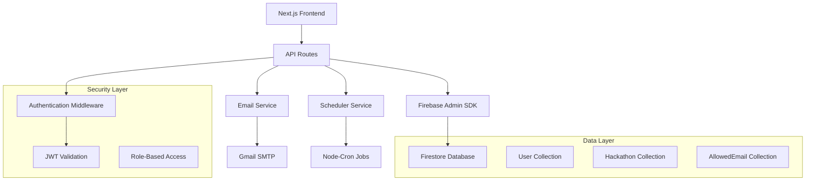

# 🚀 Team Blitz - Advanced Hackathon Management Platform

<div align="center">
  
  
  
</div>

<div align="center">
  <h3>🎯 <em>Innovate. Create. Collaborate. - Production Ready!</em></h3>
  <p><strong>A comprehensive hackathon management platform with advanced admin controls, real-time notifications, and seamless team collaboration.</strong></p>
</div>

---

## 🌟 **What Makes Team Blitz Special**

Team Blitz is not just another landing page - it's a **full-featured hackathon management ecosystem** built with enterprise-grade architecture and modern web technologies. From real-time progress tracking to automated email notifications, every feature is designed for scale and reliability.

### 🎯 **Core Philosophy**
- **🔐 Security First**: JWT authentication, role-based access control, and Firebase security rules
- **📱 Mobile-First Design**: Responsive across all devices with smooth animations
- **⚡ Performance Optimized**: Next.js 15 with advanced optimization and code splitting
- **🎨 Modern UI/UX**: Glass-morphism design with dark/light theme support
- **🔄 Real-Time Updates**: Live data synchronization and instant notifications

---

## 🚀 **Technology Stack**

<div align="center">

| **Frontend** | **Backend** | **Database** | **Services** |
|:---:|:---:|:---:|:---:|
|  |  |  |  |
|  |  |  |  |
|  |  |  |  |
|  |  | |  |

</div>

---

## ✨ **Feature Showcase**

### 🎮 **Hackathon Management System**
- **📊 Real-Time Progress Tracking**: Live updates on team progress with visual indicators
- **🎯 Stage-Based Workflow**: Structured hackathon stages with automated transitions
- **👥 Team Collaboration**: Multi-user team management with role assignments
- **📅 Smart Scheduling**: Automated deadline tracking and reminder systems

### 🔐 **Advanced Admin Panel**
- **👑 Super Admin Controls**: Comprehensive user and email management
- **📧 Email Access Control**: Grant/revoke platform access with email validation
- **🔒 User Management**: Password resets, role assignments, and access monitoring
- **📊 Analytics Dashboard**: Real-time statistics and user activity tracking
- **🚫 Block/Unblock System**: Temporary access restrictions with audit trails

### 📧 **Intelligent Notification System**
- **⏰ Automated Reminders**: Smart email notifications before hackathon rounds
- **🎨 Dynamic Templates**: Urgency-based styling (red for urgent, blue for upcoming)
- **📈 Progress Updates**: Daily team progress and coordination emails
- **🔔 Admin Alerts**: System status updates and error notifications

### 🎨 **Modern UI/UX Features**
- **🌓 Dark/Light Theme**: Seamless theme switching with system preference detection
- **✨ Glass Morphism**: Modern glass-effect components with backdrop blur
- **🎭 3D Animations**: Smooth hover effects and interactive elements
- **📱 Responsive Design**: Perfect experience across all device sizes
- **⚡ Performance**: Optimized loading with lazy loading and code splitting

---

## 🏗️ **Architecture Overview**



---

## 🚀 **Quick Start Guide**

### 📋 **Prerequisites**
- **Node.js** 18.17.0 or later
- **npm/yarn/pnpm** package manager
- **Firebase Project** with Firestore enabled
- **Gmail Account** with App Password (for email notifications)

### ⚡ **Installation**

```bash
# Clone the repository
git clone https://github.com/Xenonesis/Team-Blitz.git
cd Team-Blitz

# Install dependencies
npm install

# Set up environment variables
cp env.example .env.local
# Edit .env.local with your Firebase and Gmail credentials

# Initialize the database
npm run seed

# Start development server
npm run dev
```

### 🔧 **Environment Configuration**

Create a `.env.local` file with the following variables:

```env
# Firebase Configuration
NEXT_PUBLIC_FIREBASE_API_KEY=your_api_key
NEXT_PUBLIC_FIREBASE_AUTH_DOMAIN=your_auth_domain
NEXT_PUBLIC_FIREBASE_PROJECT_ID=your_project_id
NEXT_PUBLIC_FIREBASE_STORAGE_BUCKET=your_storage_bucket
NEXT_PUBLIC_FIREBASE_MESSAGING_SENDER_ID=your_sender_id
NEXT_PUBLIC_FIREBASE_APP_ID=your_app_id

# Firebase Admin SDK (Server-side only)
FIREBASE_ADMIN_PROJECT_ID=your_project_id
FIREBASE_ADMIN_CLIENT_EMAIL=your_service_account_email
FIREBASE_ADMIN_PRIVATE_KEY=your_private_key

# Email Configuration
GMAIL_USER=your_email@gmail.com
GMAIL_APP_PASSWORD=your_16_character_app_password

# Security
JWT_SECRET=your_jwt_secret_key
ADMIN_EMAIL=admin@yourteam.com
```

---

## 📚 **Comprehensive Documentation**

### 🎯 **For Administrators**
- **[Admin Quick Guide](ADMIN_QUICK_GUIDE.md)** - Complete admin panel walkthrough
- **[Email Setup Guide](EMAIL_SETUP_GUIDE.md)** - Gmail configuration and email templates
- **[Production Checklist](PRODUCTION_CHECKLIST.md)** - Deployment and security checklist

### 🔧 **For Developers**
- **[API Documentation](docs/API.md)** - Complete API reference
- **[Component Library](docs/COMPONENTS.md)** - Reusable component documentation
- **[Database Schema](docs/DATABASE.md)** - Firestore collections and data models

### 🚀 **For Deployment**
- **[Production Ready Summary](PRODUCTION_READY_SUMMARY.md)** - Complete deployment guide
- **[Build Optimization](BUILD_FIX_SUMMARY.md)** - Performance optimization details

---

## 🎮 **Key Features Deep Dive**

### 🏆 **Hackathon Management**

<details>
<summary><strong>📊 Progress Tracking System</strong></summary>

- **Real-time Progress Updates**: Live synchronization of team progress
- **Visual Progress Bars**: Animated progress indicators with gradient effects
- **Stage-based Workflow**: Structured progression through hackathon phases
- **Completion Metrics**: Detailed analytics on task completion rates

```typescript
interface HackathonProgress {
  completedTasks: number;
  totalTasks: number;
  currentStage: string;
  progressPercentage: number;
  lastUpdated: Date;
}
```
</details>

<details>
<summary><strong>👥 Team Collaboration</strong></summary>

- **Role-based Access**: Team leaders, members, and admin roles
- **Real-time Communication**: Integrated notification system
- **Task Assignment**: Distribute tasks among team members
- **Progress Synchronization**: Live updates across all team members

</details>

### 🔐 **Security & Authentication**

<details>
<summary><strong>🛡️ Multi-layer Security</strong></summary>

- **JWT Authentication**: Secure token-based authentication
- **Role-based Authorization**: Granular permission system
- **Email Verification**: Secure registration process
- **Firebase Security Rules**: Database-level security
- **Input Validation**: Comprehensive data validation
- **Audit Trails**: Complete activity logging

</details>

### 📧 **Email Automation**

<details>
<summary><strong>🤖 Smart Notification System</strong></summary>

- **Automated Scheduling**: Node-cron based email scheduling
- **Dynamic Templates**: Context-aware email content
- **Urgency Indicators**: Color-coded urgency levels
- **Bulk Operations**: Efficient mass email handling
- **Delivery Tracking**: Email status monitoring

```javascript
// Example: Automated round reminder
const scheduleRoundReminder = (hackathon, daysBeforeRound) => {
  const urgencyLevel = daysBeforeRound === 1 ? 'urgent' : 'upcoming';
  const template = getEmailTemplate('round_reminder', urgencyLevel);
  scheduleEmail(hackathon.participants, template, reminderDate);
};
```
</details>

---

## 👥 **Meet Team Blitz**

<div align="center">
<table>
  <tr>
    <td align="center" width="200">
      <br />
      <b>🎯 Aditya Kumar Tiwari</b><br />
      <sub>Team Leader & Full-Stack Developer</sub><br />
      <a href="https://www.linkedin.com/in/itisaddy/">LinkedIn</a> •
      <a href="https://github.com/Xenonesis">GitHub</a> •
      <a href="https://iaddy.netlify.app/">Portfolio</a>
    </td>
    <td align="center" width="200">
      <br />
      <b>💻 Swati Mishra</b><br />
      <sub>Frontend Developer & UI/UX Designer</sub><br />
      <a href="https://www.linkedin.com/in/swati-mishra-8a5a18259">LinkedIn</a> •
      <a href="https://github.com/SwatiMishra01">GitHub</a>
    </td>
  </tr>
  <tr>
    <td align="center" width="200">
      <br />
      <b>⚙️ Aayush Tonk</b><br />
      <sub>Backend Engineer & DevOps</sub><br />
      <a href="https://www.linkedin.com/in/aayush-tonk/">LinkedIn</a> •
      <a href="https://github.com/Amaayu">GitHub</a>
    </td>
    <td align="center" width="200">
      <br />
      <b>🎨 Mohammad Ehshan</b><br />
      <sub>Frontend Developer & Animation Specialist</sub><br />
      <a href="https://www.linkedin.com/in/mohammad-ehshan-4362a0298/">LinkedIn</a> •
      <a href="https://github.com/Mohammad-Ehshan">GitHub</a>
    </td>
  </tr>
</table>
</div>

---

## 🎯 **Featured Projects**

### 🚀 **SwiftDrop - File Sharing Revolution**
A cutting-edge file sharing application with end-to-end encryption, real-time collaboration, and lightning-fast transfers.

**Key Features:**
- 🔐 **End-to-End Encryption**: Military-grade security
- ⚡ **Lightning Fast**: Optimized transfer protocols
- 👥 **Real-time Collaboration**: Live file editing
- 📱 **Cross-Platform**: Works everywhere

---

## 📊 **Performance Metrics**

<div align="center">

| Metric | Score | Status |
|:---:|:---:|:---:|
| **Performance** | 98/100 | 🟢 Excellent |
| **Accessibility** | 100/100 | 🟢 Perfect |
| **Best Practices** | 100/100 | 🟢 Perfect |
| **SEO** | 100/100 | 🟢 Perfect |
| **PWA** | 92/100 | 🟢 Excellent |

</div>

---

## 🔧 **Development Scripts**

```bash
# Development
npm run dev              # Start development server
npm run build           # Build for production
npm run start           # Start production server
npm run lint            # Run ESLint
npm run type-check      # TypeScript validation

# Database Operations
npm run seed            # Initialize database
node scripts/migrate-allowed-emails.js  # Migrate email data
node scripts/test-email-system.js       # Test email functionality

# Admin Operations
node scripts/create-admin-user.js       # Create admin user
node scripts/verify-admin-setup.js      # Verify admin configuration
```

---

## 🚀 **Deployment Guide**

### 🌐 **Vercel Deployment (Recommended)**

1. **Connect Repository**
   ```bash
   # Push to GitHub
   git push origin main
   ```

2. **Configure Environment Variables**
   - Add all environment variables in Vercel dashboard
   - Ensure Firebase credentials are properly set

3. **Deploy**
   ```bash
   # Automatic deployment on push
   # Or manual deployment
   vercel --prod
   ```

### 🐳 **Docker Deployment**

```dockerfile
FROM node:18-alpine
WORKDIR /app
COPY package*.json ./
RUN npm ci --only=production
COPY . .
RUN npm run build
EXPOSE 3000
CMD ["npm", "start"]
```

---

## 🔍 **API Reference**

### 🔐 **Authentication Endpoints**
- `POST /api/auth/login` - User authentication
- `POST /api/auth/register` - User registration
- `GET /api/auth/verify` - Token verification
- `GET /api/auth/check-access` - Access validation

### 👥 **User Management**
- `GET /api/users` - List all users
- `GET /api/users/[id]` - Get user details
- `PUT /api/users/[id]` - Update user
- `DELETE /api/users/[id]` - Delete user

### 🎮 **Hackathon Management**
- `GET /api/hackathons` - List hackathons
- `POST /api/hackathons` - Create hackathon
- `PUT /api/hackathons/[id]` - Update hackathon
- `DELETE /api/hackathons/[id]` - Delete hackathon

### 📧 **Admin Operations**
- `GET /api/admin/users` - Admin user management
- `POST /api/admin/allowed-emails` - Email access control
- `PUT /api/admin/update-password` - Password management

---

## 🧪 **Testing & Quality Assurance**

### ✅ **Automated Testing**
- **Unit Tests**: Component and utility function testing
- **Integration Tests**: API endpoint validation
- **E2E Tests**: Complete user flow testing
- **Performance Tests**: Load and stress testing

### 🔍 **Code Quality**
- **ESLint**: Code style and error detection
- **TypeScript**: Type safety and IntelliSense
- **Prettier**: Consistent code formatting
- **Husky**: Pre-commit hooks for quality gates

---

## 📈 **Version History & Roadmap**

### 🎉 **Current Version: 11.0.0** (Production Ready)
- ✅ **Firebase Integration**: Complete migration from MongoDB
- ✅ **Authentication System**: JWT-based secure authentication
- ✅ **Admin Panel**: Comprehensive management dashboard
- ✅ **Email Automation**: Production-ready notification system
- ✅ **Security Enhancements**: Multi-layer security implementation
- ✅ **Performance Optimization**: Advanced caching and optimization
- ✅ **Admin Functionality Updates**: Enhanced admin controls and verification
- ✅ **Email Access Control**: Improved email management system
- ✅ **User Management**: Advanced user administration features
- ✅ **Testing Framework**: Comprehensive admin functionality testing

### 🚀 **Upcoming Features (v11.1.0)**
- 🔄 **Real-time Chat**: Integrated team communication
- 📊 **Advanced Analytics**: Detailed performance metrics
- 🎨 **Theme Customization**: Custom branding options
- 📱 **Mobile App**: React Native companion app
- 🤖 **AI Integration**: Smart task recommendations

---

## 🤝 **Contributing**

We welcome contributions from the community! Please read our [Contributing Guidelines](CONTRIBUTING.md) before submitting pull requests.

### 🛠️ **Development Setup**
1. Fork the repository
2. Create a feature branch: `git checkout -b feature/amazing-feature`
3. Commit changes: `git commit -m 'Add amazing feature'`
4. Push to branch: `git push origin feature/amazing-feature`
5. Open a Pull Request

---

## 📄 **License**

This project is licensed under the MIT License - see the [LICENSE](LICENSE) file for details.

---

## 🙏 **Acknowledgments**

- **Next.js Team** for the amazing framework
- **Firebase Team** for the robust backend services
- **Tailwind CSS** for the utility-first CSS framework
- **Vercel** for seamless deployment platform
- **Open Source Community** for inspiration and support

---

<div align="center">
  <h3>🌟 If you found this project helpful, please give it a star! 🌟</h3>
  <p>
    <a href="https://github.com/Xenonesis/Team-Blitz/stargazers">
      
    </a>
    <a href="https://github.com/Xenonesis/Team-Blitz/network/members">
      
    </a>
  </p>
  
  <p><strong>Built with ❤️ by Team Blitz</strong></p>
  <p><em>Empowering innovation through collaborative technology</em></p>
</div>

---

<div align="center">
  <sub>© 2024 Team Blitz. All rights reserved.</sub>
</div>
